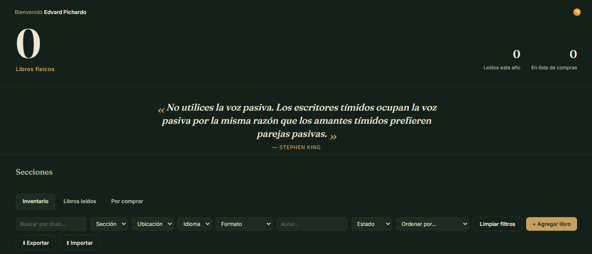
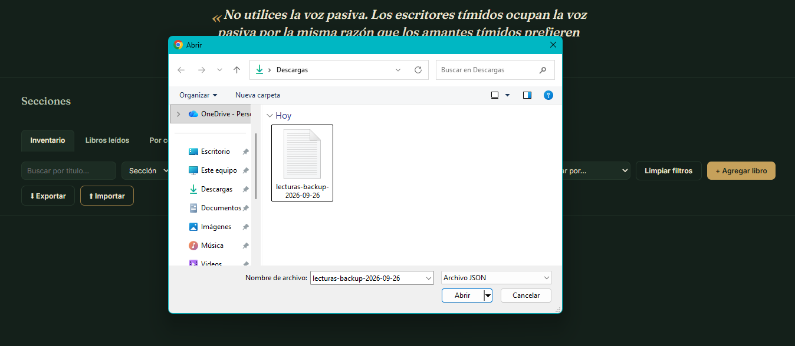
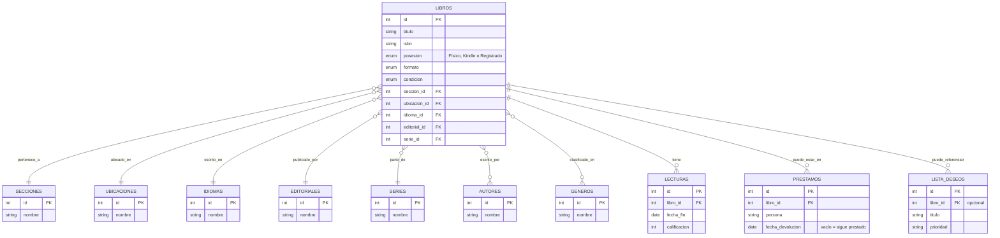

<div align="center">
  
# Inventario de Biblioteca Personal


Aplicación de inventario para llevar el control de una colección de libros física y digital: cuántos libros hay, dónde está cada uno, qué se ha leído y qué falta por comprar — con una base de datos relacional en MySQL como columna vertebral.

</div>

<p align="center">
  
</p>

---

## Contenido

- [Funcionalidad](#funcionalidad)
- [Arquitectura](#arquitectura)
- [Modelo de datos](#modelo-de-datos)
- [Stack](#stack)
- [Instalación](#instalación)
- [Estructura del proyecto](#estructura-del-proyecto)
- [Autor y licencia](#autor-y-licencia)

---

## Funcionalidad

- **Inicio con panorama general** — contador total de libros físicos, más libros leídos en el año y pendientes de compra, con una frase sobre libros o escritura distinta cada día.
- **Estanterías por sección** — Académico, Divulgación, Novelas, Cómics, Revistas, Engargolados, Enciclopedias, y una sección "Perdida" para ejemplares de mala edición o muy desgastados. Cada una muestra su total y filtra la lista al hacer clic.
- **Filtros combinables** — texto (con búsqueda progresiva), sección, ubicación, idioma, formato, autor (con autocompletado buscable), estado de lectura y varios criterios de orden, todos a la vez.
- **Ubicación física** — cada libro se asigna a un lugar de la biblioteca o, en este caso, habitación.
- **Alta rápida por ISBN** — autocompleta título, autor, editorial, año, páginas y portada consultando Open Library y, si no encuentra nada, Google Books. Las portadas se muestran automáticamente en la lista; si una no carga, se reemplaza por un lomo de color sin romper el diseño.
- **Tres formas de tener un libro** — Físico (cuenta en el inventario y necesita ubicación), Kindle, y Registrado, para un libro que leíste sin tenerlo en el cuarto (prestado, digital, de otra fuente). Esto permite que "Leídos" y "Lista de compras" referencien cualquier libro sin duplicar información ni forzarlo a aparecer como parte del inventario físico.
- **Registro de lectura** — vincula la lectura a un libro ya existente
  (buscador con autocompletado) o da de alta uno nuevo al vuelo; guarda
  calificación, opinión y fecha de término. Un libro puede releerse: cada
  lectura es una fila independiente. Incluye su propio filtro por año,
  formato y calificación, y respaldo del historial exportando/importando un
  archivo JSON.
- **Lista de compras** — títulos con prioridad, precio estimado, formato
  deseado y motivo, con sus propios filtros y orden.
- **Edición en lote** — selección múltiple para mover de ubicación, cambiar
  de sección o eliminar varios libros a la vez.
- **Catálogo de autores siempre limpio** — cuando un autor deja de estar
  asociado a cualquier libro (por edición o eliminación), el backend lo
  retira solo del catálogo.
- **Notificaciones e interacciones propias** — avisos tipo *toast* y
  diálogos de confirmación hechos a la medida, en vez de las alertas nativas
  del navegador.
- **Modo claro/oscuro** — interruptor que recuerda la preferencia entre
  sesiones (`localStorage`), con un saludo personalizable en la parte
  superior.
- **Respaldo del inventario físico** — exportar todos los libros físicos a
  un archivo JSON e importarlos de vuelta (los libros nuevos se añaden, sin
  borrar lo existente).

<p align="center">
  
</p>

---

## Arquitectura

```
┌──────────────────────┐        HTTP / JSON        ┌───────────────────────┐        SQL        ┌─────────────┐
│   Frontend (HTML/JS)  │  ────────────────────────▶ │   API (FastAPI)       │ ─────────────────▶ │   MySQL     │
│   filtros, modales,   │ ◀──────────────────────── │   validación,          │ ◀───────────────── │  relacional │
│   autocompletados     │                            │   reglas de negocio    │                     │             │
└──────────────────────┘                            └───────────────────────┘                     └─────────────┘
```

El frontend no habla con la base de datos directamente, sino que toda la lógica de
filtrado, edición en lote, limpieza de autores huérfanos y consulta de ISBN
pasa por la API, que es la única que conoce las credenciales de MySQL.

---

## Modelo de datos

Base de datos relacional normalizada: catálogos independientes para
secciones, ubicaciones, idiomas, editoriales, autores, géneros y series, con
tablas puente para relaciones muchos-a-muchos (un libro puede tener varios
autores). `libros` distingue un ejemplar físico de uno leído en Kindle o
solo "Registrado" mediante la columna `posesion`, lo que permite que
"Leídos" y "Lista de compras" referencien cualquiera de los tres sin
duplicar información. Cada lectura es una fila propia en `lecturas`, así que
releer un libro es simplemente otra fila con el mismo `libro_id`. Incluye
vistas SQL (`v_inventario`, `v_conteo_seccion`, `v_conteo_ubicacion`) que
resuelven los conteos y filtros que consume la interfaz.



Las relaciones `LIBROS }o--o{ AUTORES` y `LIBROS }o--o{ GENEROS` son
muchos-a-muchos: en la base de datos física se implementan con las tablas
puente `libro_autor` y `libro_genero`, que aquí se omiten para que el
diagrama se lea de un vistazo.

---

## Stack

| Capa | Tecnología |
|---|---|
| Base de datos | MySQL 8, con vistas para reportes |
| Backend | Python, FastAPI, SQLAlchemy |
| Frontend | HTML, CSS y JavaScript nativo (sin framework) |
| Autocompletado de metadatos | Open Library (`search.json` + portadas) / Google Books, como respaldo |

--- 
## Instalación

```bash
# 1. Base de datos (los archivos en database/ están numerados y se ejecutan en orden)
mysql -u root -p < database/01_base_y_catalogos.sql
mysql -u root -p < database/02_tablas_principales.sql
mysql -u root -p < database/03_modelo_relacional.sql
mysql -u root -p < database/04_vistas.sql
mysql -u root -p < database/05_datos_iniciales.sql

El último archivo es opcional. Ahí se da un ejemplo de cómo introducir los campos requeridos a cada tabla.

# 2. Backend
python -m venv venv
venv\Scripts\activate          # Windows
pip install -r requirements.txt
# edita tus credenciales de MySQL en el archivo .env
uvicorn app.main:app --reload

# 3. Frontend
cd frontend
python -m http.server 5500
```

Con la API en `http://127.0.0.1:8000` y el frontend en
`http://localhost:5500`, la aplicación queda lista. La documentación
interactiva de la API está en `http://127.0.0.1:8000/docs`.

---

## Estructura del proyecto

```
inventario-biblioteca-personal/
├── database/               # esquema dividido: catálogos, tablas, relaciones, vistas, datos iniciales
├── requirements.txt
├── app/
│   ├── database.py         # conexión a MySQL
│   ├── models.py           # tablas como clases (SQLAlchemy)
│   ├── schemas.py          # validación de datos de entrada/salida
│   ├── crud.py             # consultas, filtros combinables, lotes, limpieza de autores
│   ├── isbn_lookup.py      # autocompletado por ISBN
│   └── main.py             # endpoints de la API
└── frontend/
    ├── index.html          # estructura de la interfaz
    ├── styles.css          # apariencia
    ├── app.js              # lógica: llamadas a la API, filtros, modales, autocompletados
    └── frases.js           # frases sobre libros y escritura para el banner del inicio
```
---

## Autor y licencia

**Cristian Eduardo Pichardo Rico**

Egresado de la Licenciatura en Física, Facultad de Ciencias, UNAM

Linkedin: [Edvard Pichardo](https://www.linkedin.com/in/edvard-pichardo) · GitHub: [@Edvard-Pichardo](https://github.com/Edvard-Pichardo)

Distribuido bajo la licencia **MIT**. Consulta el archivo [LICENSE](LICENSE) para más información.
